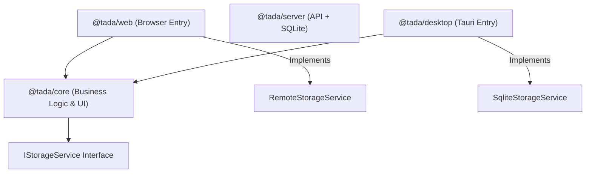

# Tada - A Modern, Offline-First, AI-Powered Task Management App

<div align="center">

[🇨🇳 中文](./README.zh-CN.md) | [🇬🇧 English](./README.md)

<br />


<br />

### The Local-First, AI-Augmented Workspace for Professionals.

[](LICENSE)
[](https://www.typescriptlang.org/)
[](https://reactjs.org/)
[](https://tauri.app/)
[]()

</div>

> [!IMPORTANT]
> **⚠️ macOS Users: Read Before Installing**
>
> Since this is an open-source project without a paid Apple Developer ID, macOS Gatekeeper may falsely report that **"Tada.app is damaged and can't be opened. You should move it to the Trash."**
>
> This is not a bug. To bypass this security check, please open your **Terminal** and run the following command after moving the app to your Applications folder:
>
> ```bash
> sudo xattr -r -d com.apple.quarantine /Applications/Tada.app
> ```
>
> *(You may need to enter your password. Characters will not show while typing.)*

-----

## 📖 Overview

**Tada** is a meticulously crafted task management solution that bridges the gap between traditional productivity tools and the era of Generative AI. Unlike cloud-centric alternatives, Tada is built on a **Local-First** philosophy. Whether you are using the web version or the native desktop application, your data remains strictly under your control.

Engineered as a modern Monorepo, Tada leverages **React** and **Jotai** for a fluid, reactive user experience, while **Tauri** provides a secure, performant native runtime. At its heart lies **Moondown**, a bespoke, WYSIWYG Markdown editor powered by CodeMirror 6, featuring AI-driven text continuation ("Ghost Writer") and slash commands.

-----

## 📷 Screenshots

<div align="center">

<br />


<br />

</div>

-----

## ✨ Key Features

### 🔒 Privacy & Data Sovereignty

Tada is designed for the privacy-conscious user.

* **Zero Data Collection:** No tracking, no analytics, no remote servers for data storage.
* **Adaptive Persistence Layer:**
    * **Web:** Utilizes `LocalStorage` and `IndexedDB` for instant, browser-based persistence.
    * **Desktop:** Leverages `SQLite` via Tauri for robust, file-system based storage capable of handling massive datasets.
* **BYOK (Bring Your Own Key):** AI features connect directly from your device to the provider (OpenAI, Anthropic, etc.). Your API keys never leave your machine.

### 🧠 Intelligent Workflows

Tada integrates Large Language Models (LLMs) deeply into the workflow, not just as a chatbot, but as a productivity engine.

* **Natural Language Capture:** Describe a complex project in plain English. Tada parses it into a structured task with a title, description, due date, priority, tags, and subtasks automatically.
* **Ghost Writer:** An AI co-pilot embedded within the task description editor. It understands the context of your task and suggests content, outlines, or next steps in real-time.
* **Smart Summaries:** Select any date range or list to generate comprehensive Markdown reports of your accomplishments, pending items, and future blockers.

### 📝 The Moondown Editor

A powerful, custom-built Markdown editing experience.

* **Hybrid Editing:** Writes like a document, saves as Markdown.
* **Rich Features:** Support for GFM (GitHub Flavored Markdown), tables, images (drag & drop), checklists, and code blocks with syntax highlighting.
* **Slash Commands:** Type `/` to instantly access formatting tools, insert tables, or trigger AI generation.

### 🎨 Refined UI/UX

* **Calendar View:** A fully interactive drag-and-drop calendar for rescheduling tasks.
* **Kanban & Lists:** Flexible organization with custom lists and tags.
* **Beautiful Theming:** Native Dark/Light mode support with configurable accent colors (Coral, Ocean, Forest, etc.).
* **Fluid Animations:** Powered by `framer-motion` for a tactile, responsive feel.

-----

## 🏗 Architecture

Tada employs a robust Monorepo structure managed by `pnpm workspaces`, ensuring code sharing and strict separation of concerns.



* **`packages/core`**: The nucleus of the application. Contains reusable UI components (Radix UI + Tailwind), Jotai state atoms, React hooks, i18n locales, and the `Moondown` editor logic.
* **`packages/web`**: Web wrapper that connects to the self-hosted API server for auth and database storage.
* **`packages/desktop`**: A Rust-backed wrapper using Tauri. Injects the `SqliteStorageService` for ACID-compliant database storage and system tray integration.
* **`packages/server`**: Self-hosted API server (Express + SQLite) for auth and data persistence.

-----

## 🛠 Technology Stack

| Domain | Technologies |
| :--- | :--- |
| **Frontend Framework** | React 18, TypeScript 5.7 |
| **Build Tooling** | Vite 6, pnpm workspaces |
| **State Management** | Jotai (Atomic, primitive-based state) |
| **Styling System** | Tailwind CSS v3, Radix UI Primitives, clsx/tailwind-merge |
| **Editor Engine** | CodeMirror 6, Lezer Parsers |
| **Native Runtime** | Tauri v2, Rust, SQLite |
| **AI & Networking** | Native Fetch Streaming, AbortController signals |
| **Internationalization** | i18next, react-i18next |

-----

## 🚀 Getting Started

### Prerequisites

* **Node.js**: v18.0.0 or higher.
* **pnpm**: v9.0.0+ (Recommended package manager).
* **Rust & Cargo**: Required only for building the desktop application.

### Installation

1.  **Clone the repository:**

    ```bash
    git clone https://github.com/LoadShine/tada.git
    cd tada
    ```

2.  **Install dependencies:**

    ```bash
    pnpm install
    ```

### Development

**API Server:**
Run the SQLite-backed API server.

```bash
pnpm dev:server
```

Copy `packages/server/.env.example` to `packages/server/.env` and set at least `TADA_JWT_SECRET` and `TADA_DB_PATH`.

**Web Environment:**
Run the standalone web application in your browser.

```bash
pnpm dev
# Application accessible at http://localhost:5173/tada/
```

Copy `packages/web/.env.example` to `packages/web/.env` and set `VITE_TADA_API_URL` (for example: `http://localhost:8787`).

**Desktop Environment:**
Run the application in a native window using Tauri.

```bash
pnpm dev:desktop
```

-----

## 🔌 AI Configuration

To unlock Tada's full potential, configure an AI provider.

1.  Navigate to **Settings** > **AI Settings**.
2.  **Cloud Providers:** Select OpenAI, Anthropic, or Google. Enter your API key.
3.  **Local LLMs (Ollama):**
    * Ensure Ollama is running (`ollama serve`).
    * Select **Ollama** as the provider.
    * Set Base URL to `http://localhost:11434`.
    * Model fetching is automatic.

-----

## 🔐 Auth & Registration (Web)

- Email + password login for the web app.
- Registration can be disabled with `TADA_ALLOW_REGISTRATION=false`.
- The first registered user is assigned the `admin` role.
- If registration is disabled and no users exist, set `TADA_DEFAULT_ADMIN_EMAIL` and `TADA_DEFAULT_ADMIN_PASSWORD` to bootstrap an admin account.
- Web data is stored in SQLite on the server; no automatic migration from localStorage is performed.

-----

## 📦 Building for Production

**Web Build:**
Generates a static site in `packages/web/dist` suitable for Netlify, Vercel, or GitHub Pages.

```bash
pnpm build
```

**Server Build:**
Builds the API server into `packages/server/dist`.

```bash
pnpm build:server
```

**Desktop Build:**
Generates native binaries (`.dmg`, `.exe`, `.deb`) via Tauri.

```bash
pnpm build:desktop
```

-----

## 🤝 Contributing

We welcome contributions from the community. Whether it's a bug fix, a new feature for the Moondown editor, or a translation update, your input is valued.

1.  Fork the project.
2.  Create your feature branch (`git checkout -b feature/AmazingFeature`).
3.  Commit your changes (`git commit -m 'Add some AmazingFeature'`).
4.  Push to the branch.
5.  Open a Pull Request.

-----

## 📄 License

Distributed under the **Apache 2.0 License**. See [LICENSE](./LICENSE) for more information.
